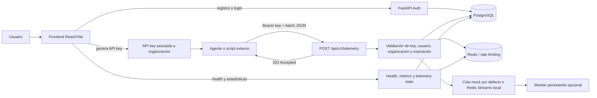

<div align="center">

<p align="center">
  
</p>

<!-- La portada oficial se conserva hasta disponer de una variante clara equivalente; el selector claro/oscuro sí está disponible en la aplicación. -->

# SentinelMonitorIA — Observabilidad, inteligencia artificial y AIOps

### Telemetría, análisis inteligente y alertas multicanal

Plataforma para autenticar usuarios, administrar organizaciones, recibir telemetry de agentes, detectar señales operativas y distribuir alertas mediante una API FastAPI.

<p>
  <a href="#inicio-rápido-en-windows">Inicio rápido</a> ·
  <a href="#cómo-funciona">Cómo funciona</a> ·
  <a href="#autenticación-local">Autenticación</a> ·
  <a href="#api-keys-y-conexión-de-agentes">API keys</a> ·
  <a href="#contrato-de-telemetry">Telemetry</a> ·
  <a href="#inteligencia-y-alertas">IA y alertas</a> ·
  <a href="#roadmap">Roadmap</a>
</p>

<p>
  
  
  
  
</p>

</div>

> **Fuente de verdad:** esta guía describe el estado real del repositorio. Las capacidades marcadas como futuras o preparatorias no forman parte del flujo local validado.

## Navegación documental

La documentación centralizada está en [`docs/README.md`](docs/README.md). Desde allí se conectan el estado local, la arquitectura AWS, el diagrama editable, las alternativas CloudFormation, los costes, la seguridad, la operación y la evidencia de validación.

- [Arquitectura local y AWS](docs/architecture/README.md)
- [Diagrama AWS editable](docs/architecture/sentinelmonitoria-aws-architecture.drawio)
- [Vista AWS en Markdown](docs/architecture/sentinelmonitoria-aws-architecture.md)
- [Despliegue CloudFormation por fases](docs/deployment/cloudformation-phased-plan.md)
- [Índice de infraestructura y despliegue](docs/deployment/README.md)
- [Estimación mensual AWS](docs/deployment/aws-monthly-estimate.md)
- [Runbook local](docs/operations/local-runbook.md)
- [Informe de validación local](docs/operations/local-validation-report.md)
- [Foundation CloudFormation](infra/cloudformation/README.md)
- [CloudFormation modular](infra/cloudformation/phases/README.md)

La infraestructura AWS está documentada y validada offline, pero no se han desplegado recursos AWS. La foundation monolítica y los stacks modulares son alternativas excluyentes para un mismo entorno.

## Qué es SentinelMonitorIA

SentinelMonitorIA es un MVP local de observabilidad. Su recorrido principal es:

```text
Usuario → organización → sesión JWT → API key → agente → telemetry → PostgreSQL + cola mock o Redis Streams
```

En la práctica, permite que una persona cree una organización desde el dashboard, genere una API key y conecte un agente o script externo para enviar métricas, logs y eventos a un backend centralizado. El sistema valida la identidad, la organización, la expiración y el estado de la key antes de aceptar cada batch.

### Qué puedes hacer hoy

| Capacidad | Resultado actual |
|---|---|
| Gestionar acceso | Registro, login, refresh, `/me`, logout y cambio de contraseña. |
| Organizar datos | Crear una organización inicial y asociar usuarios a ella. |
| Conectar agentes | Emitir, listar, rotar y revocar API keys desde `Connections`; las keys tienen scopes explícitos. |
| Recibir observabilidad | Ingerir métricas, logs y eventos mediante `/api/v1/telemetry`. |
| Operar el entorno | Consultar health, métricas, colas mock y servicios Docker. |
| Trabajar localmente | Ejecutar todo con Windows, Docker Compose, PostgreSQL y Redis; sin AWS real. |

### Qué representa ahora

El núcleo local sigue siendo de desarrollo, pero ya incluye una primera capa AIOps asíncrona: reglas para detectar señales de CPU, memoria, logs y eventos; persistencia de `AIAnalysis` y `Alert`; entregas idempotentes; y canales de log, Email/SMTP, Webhooks, Slack, Discord, Teams y WebSocket. Ollama y Bedrock son proveedores opcionales para explicaciones y contexto RAG. Las acciones automáticas permanecen desactivadas.

AWS/Bedrock, S3 de archivo, IAM, workers ECS y notificaciones tienen fases CloudFormation `19`–`22` preparadas y validadas offline. No forman parte de un despliegue realizado. El Knowledge Base/vector store persistente debe configurarse de forma explícita porque implica decisiones de embeddings, índice, retención y coste.

## Cómo funciona

El flujo completo de una sesión a una ingesta es el siguiente:



1. **El usuario se registra.** El backend crea el usuario, la organización inicial y la membresía administrativa.
2. **El usuario inicia sesión.** FastAPI entrega un access token y un refresh token; ambos `jti` se registran en PostgreSQL. El frontend restaura la sesión y la renueva mediante rotación de refresh tokens de un solo uso.
3. **Se crea una API key.** La key queda asociada al usuario y a una organización, se muestra completa una sola vez y después solo se expone su metadata.
4. **Un agente envía telemetry.** Utiliza `Authorization: Bearer <API_KEY>` y publica un batch con metadata y métricas, logs o eventos.
5. **El backend valida el acceso.** Comprueba firma JWT, tipo `api_key`, existencia en PostgreSQL, estado activo, expiración, usuario, organización y el scope requerido (`telemetry:write`).
6. **Se registra el agente y el batch.** Si el agente no existe para esa organización, se crea. El batch se persiste y se prepara para procesamiento.
7. **La cola recibe el trabajo.** El entorno local mantiene `QUEUE_PROVIDER=mock` por defecto; con `docker-compose.redis-worker.yml` se activa Redis Streams, consumer group, ACK posterior al commit y un worker persistente.
8. **El dashboard observa el sistema.** Consulta salud, estadísticas, métricas y estado de servicios para mostrar la operación local.

La aplicación usa automáticamente `http://localhost:8000/api/v1/telemetry` en el entorno local. No es necesario introducir una URL arbitraria desde `Connections`; una URL personalizada será relevante cuando el backend se publique detrás de otro dominio.

## Inteligencia y alertas

La ingesta no espera a un modelo. Cuando se activa Redis Streams, el flujo es:

```text
POST /api/v1/telemetry
        │
        ▼
worker telemetry → PostgreSQL
        │
        ▼
cola ai_analysis
        │
        ├── reglas CPU/memoria/logs/eventos
        ├── Ollama local o Bedrock opcional
        └── AIAnalysis + Alert
                    │
                    ▼
             cola notifications
                    │
                    ├── log local
                    ├── Email/SMTP
                    ├── Slack / Discord / Microsoft Teams
                    ├── Webhook firmado
                    └── WebSocket del dashboard
```

Para activar el flujo durable local:

```powershell
docker compose -f backend\docker-compose.yml -f backend\docker-compose.redis-worker.yml up -d --build backend worker ai-worker notification-worker
```

Configuración principal:

| Variable | Local | AWS |
|---|---|---|
| `AI_PROVIDER` | `rules` o `ollama` | `rules` o `bedrock` |
| `AI_MODEL_ID` | No requerido para reglas/Ollama | ID del modelo Bedrock aprobado |
| `AI_KNOWLEDGE_BASE_ID` | Vacío o contexto del batch | Knowledge Base Bedrock existente opcional |
| `NOTIFICATION_CHANNELS` | `log`, SMTP o webhooks | `log`, SES/SMTP, Slack, Discord, Teams o webhook |
| `AI_ENABLE_ACTIONS` | `false` | `false` |

Endpoints disponibles:

- `GET /api/v1/alerts`: lista alertas de las organizaciones del usuario.
- `POST /api/v1/alerts/{alert_id}/acknowledge`: reconoce una alerta sin ejecutar acciones.
- `WS /api/v1/alerts/ws?access_token=...`: novedades de alertas para el dashboard.

La guía de arquitectura y el contrato de despliegue están en [`docs/architecture/README.md`](docs/architecture/README.md) y [`docs/deployment/cloudformation-phased-plan.md`](docs/deployment/cloudformation-phased-plan.md).

## Chatbot operativo

El dashboard incluye un chat autenticado para consultar el contexto reciente de alertas de la organización. En local usa `CHAT_PROVIDER=rules`, no realiza llamadas externas y mantiene la conversación sólo en memoria del navegador. El endpoint `POST /api/v1/chat` devuelve respuestas normalizadas, sugerencias, fuentes allowlisted y acciones vacías porque las acciones automáticas están deshabilitadas.

La interfaz está separada del proveedor para poder conservarse cuando se implemente AWS. La evolución prevista es Lex V2 para intenciones y parámetros estructurados, y Bedrock para explicaciones, respuestas generativas y RAG. El backend será la fachada que mantenga JWT, aislamiento por organización, permisos, auditoría y ejecución de acciones permitidas; el navegador no llamará directamente a servicios AWS.

Configuración local:

```env
CHAT_PROVIDER=rules
CHAT_CONTEXT_ALERT_LIMIT=20
CHAT_MAX_MESSAGE_LENGTH=2000
CHAT_ENABLE_ACTIONS=false
```

Lex + Bedrock, Knowledge Base y acciones controladas están preparados como evolución, pero no forman parte de un despliegue AWS realizado.

## Estado del proyecto

| Área | Estado | Descripción |
|---|---|---|
| Backend FastAPI | Implementado | API local en `http://localhost:8000`. |
| PostgreSQL | Implementado | Persistencia local mediante Docker Compose. |
| Redis | Implementado | Cache, health checks y servicios auxiliares. |
| Cola mock / Redis Streams | Implementado localmente | `mock` sigue siendo el proveedor predeterminado; el override activa streams Redis durables. |
| Worker de telemetry | Implementado localmente | Consumer group, recuperación de pendientes, ACK, reintentos, dead-letter y persistencia PostgreSQL. |
| Motor IA y alertas | Implementado localmente | Reglas de anomalías, `AIAnalysis`, `Alert`, deduplicación y acknowledge autenticado; Ollama/Bedrock opcionales. |
| Notificaciones | Implementado localmente | Worker asíncrono con log, Email/SMTP, Webhook, Slack, Discord, Teams y WebSocket. |
| Frontend React/Vite | Implementado | Dashboard ejecutivo protegido en `http://localhost:3000`. |
| Registro y login | Implementado | Login por username o email, JWT access/refresh y restauración de sesión. |
| API keys | Implementado | Creación, listado, scopes, rotación explícita, revocación y validación persistida para telemetry. |
| Ingestión telemetry | Implementado localmente | Requiere una API key asociada a una organización. |
| Agente Vector | Validado localmente | Configuración normal Vector `0.36.0` validada por esquema; pipeline E2E aislado con fixture JSONL, API key `telemetry:write`, Redis Streams, worker y persistencia PostgreSQL. La ejecución de fuentes host/journald/Docker queda pendiente en un host Linux real. |
| AWS/Bedrock/S3 | Preparado offline | Fases CloudFormation `19`–`22` para archivo IA, IAM Bedrock, workers ECS y notificaciones; no desplegado. |
| Terraform/CDK | Pendiente | Directorios reservados para infraestructura futura. |
| Pruebas automatizadas | Implementado localmente | Auth, API keys, contrato QueueMessage, productor/ACK, retries-DLQ y persistencia del worker Redis. |

## Arquitectura local

```text
┌───────────────────────────────┐
│ React + Vite                  │
│ http://localhost:3000         │
│ Login, dashboard, API keys    │
└───────────────┬───────────────┘
                │ HTTP + CORS + Bearer JWT
                ▼
┌───────────────────────────────┐
│ FastAPI                       │
│ http://localhost:8000         │
│ Auth, health, telemetry       │
└──────────┬────────────┬───────┘
           │            │
           ▼            ▼
┌────────────────┐ ┌────────────────┐
│ PostgreSQL     │ │ Redis          │
│ localhost:5432 │ │ localhost:6379 │
└────────────────┘ └────────────────┘
```

### Flujo de telemetry

```text
Usuario registra organización
        │
        ▼
Genera API key desde Connections
        │
        ▼
Configura endpoint + Bearer key en el agente
        │
        ▼
POST /api/v1/telemetry
        │
        ├── valida JWT API key en PostgreSQL
        ├── comprueba organización y expiración
        ├── crea/actualiza el agente
        └── procesa el batch en la cola mock
```

La API key es un token emitido por SentinelMonitorIA. El usuario no necesita introducir una URL arbitraria para el flujo normal: el sistema muestra automáticamente el endpoint configurado, por ejemplo `http://localhost:8000/api/v1/telemetry`. Una URL personalizada solo será necesaria cuando la instalación esté publicada detrás de otro dominio o cuando se agreguen integraciones externas.

## Estructura del repositorio

```text
SentinelMonitorIA/
├── agent/                         # Agente Vector y flujo E2E local aislado
│   ├── configs/                    # Configuración normal y vector.e2e.toml
│   ├── deploy/                    # Instalador, entrypoint, healthcheck y Compose
│   ├── fixtures/                  # Fixture JSONL métrica/log/evento
│   ├── scripts/                   # Generador PowerShell de batch IDs
│   ├── Dockerfile
│   ├── Dockerfile.e2e
│   └── README.md
├── backend/
│   ├── src/main.py                # Aplicación FastAPI, CORS, health y métricas
│   ├── src/api/v1/                # Routers auth, health y telemetry
│   ├── src/config/                # Settings y logging
│   ├── src/database/              # PostgreSQL async y Redis
│   ├── src/middleware/            # Fachada de compatibilidad para routers antiguos
│   ├── src/models/                # User, Organization, Token y telemetry
│   ├── src/schemas/               # Contratos Pydantic
│   ├── src/services/              # Auth, rate limiter y telemetry
│   ├── tests/                     # Estructura reservada para tests
│   ├── Dockerfile
│   ├── docker-compose.yml
│   ├── requirements.txt
│   └── README.md
├── docs/architecture/             # Documentación técnica del agente
├── frontend/
│   ├── src/App.jsx                # Auth, dashboard y Connections
│   ├── src/auth.js                # Sesión, auth y API keys
│   ├── src/api.js                 # Cliente del dashboard y Prometheus parser
│   ├── src/styles.css              # Sistema visual responsive
│   ├── package.json
│   └── vite.config.js
├── infra/                          # Terraform/CDK reservados para futuras fases
├── scripts/                        # Scripts PowerShell de operación local
├── workers/                        # Reservado para consumidores/procesadores
├── .env.example                    # Variables generales y futuras
└── README.md                       # Guía principal
```

## Requisitos

Para el flujo local en Windows:

- Windows 10/11.
- Docker Desktop con el engine iniciado.
- Docker Compose v2 (`docker compose`).
- Node.js y npm para el frontend.
- PowerShell.
- Git opcional.

Versiones usadas durante la validación:

```text
Node.js  v24.14.1
npm      v11.11.0
Vite     v8.1.5
Python   3.12 dentro de la imagen backend
```

El backend se ejecuta dentro de Docker, por lo que no es necesario instalar Python para el flujo recomendado.

## Inicio rápido en Windows

Todos los comandos siguientes deben ejecutarse desde la raíz `SentinelMonitorIA`.

### 1. Verificar Docker

```powershell
.\scripts\check-docker.ps1
```

El script detecta automáticamente la instalación por usuario de Docker Desktop, comprueba el CLI, Compose, el daemon, ejecuta un contenedor `hello-world` y muestra el estado de WSL.

Si Docker no está en el `PATH`, el script intenta añadir automáticamente:

```text
%LOCALAPPDATA%\Programs\DockerDesktop\resources\bin
```

También se puede añadir manualmente a la sesión actual:

```powershell
$env:Path = "$env:LOCALAPPDATA\Programs\DockerDesktop\resources\bin;$env:Path"
```

### 2. Iniciar backend y servicios

Primera ejecución o después de cambiar dependencias:

```powershell
.\scripts\start-local.ps1 -Build
```

Ejecuciones posteriores:

```powershell
.\scripts\start-local.ps1
```

Para levantar también el frontend dentro de Docker, sin abrir una segunda terminal:

```powershell
.\scripts\start-local.ps1 -Build -Frontend
```

El modo `-Frontend` usa el override opcional `backend/docker-compose.frontend.yml`, conserva los datos del backend y publica Vite en `http://localhost:3000`. No lo uses mientras exista otro Vite manual ocupando ese puerto.

El script inicia PostgreSQL, Redis, backend, Adminer y Redis Commander. LocalStack no se inicia por defecto.

Comprobar estado:

```powershell
docker compose -f backend\docker-compose.yml ps
Invoke-RestMethod http://localhost:8000/health
```

Para ver logs:

```powershell
docker compose -f backend\docker-compose.yml logs -f backend
```

Para detener servicios sin borrar datos:

```powershell
docker compose -f backend\docker-compose.yml down
```

Para detener y borrar volúmenes locales, incluyendo usuarios y telemetry:

```powershell
.\scripts\start-local.ps1 -Clean
```

`-Clean` es destructivo para el estado local y no debe usarse como rutina.

### 3. Iniciar frontend

La opción manual conserva el flujo Vite actual:

```powershell
Set-Location frontend
npm ci
npm run dev
```

La configuración de Vite usa `localhost:3000` y `strictPort`. Abrir:

```text
http://localhost:3000
```

El frontend usa por defecto:

```text
http://localhost:8000
```

Para usar otra API durante la sesión actual de PowerShell:

```powershell
$env:VITE_API_BASE_URL = "http://localhost:8000"
npm run dev
```

Como alternativa, el frontend puede ejecutarse dentro de Docker junto al stack:

```powershell
# Detener primero cualquier Vite manual que use el puerto 3000
docker compose -f backend\docker-compose.yml -f backend\docker-compose.frontend.yml up -d --build
Invoke-WebRequest http://localhost:3000/ -UseBasicParsing
```

Para detener el frontend Docker sin borrar datos del backend:

```powershell
docker compose -f backend\docker-compose.yml -f backend\docker-compose.frontend.yml down
```

Para detener Vite manual, usar `Ctrl+C` en su terminal.

### 4. Ejecutar el E2E real del agente

El flujo Vector → FastAPI → Redis Streams → worker → PostgreSQL está documentado y validado para Windows + Docker en [`agent/README.md`](agent/README.md#flujo-e2e-local-en-windows--docker). Usa un Compose aislado, la red `backend_sentinel-network` y una API key real asociada a una organización con scope `telemetry:write`; no inicia AWS, mock API ni elimina volúmenes.

```powershell
pwsh -File agent/scripts/generate-e2e-fixture.ps1
docker compose -f agent\deploy\docker-compose.e2e.yml up -d --build --force-recreate
docker exec sentinel-redis redis-cli XPENDING sentinel:stream:telemetry sentinel-telemetry-workers
```

El procedimiento completo para crear la key, revisar los tres batches `processed` y repetir la prueba está en la guía del agente.

## Servicios, puertos y datos

| Servicio | URL/puerto | Uso |
|---|---|---|
| Frontend Vite | `http://localhost:3000` | Login, dashboard y conexiones |
| Backend FastAPI | `http://localhost:8000` | API principal |
| Swagger | `http://localhost:8000/api/v1/docs` | Documentación interactiva en desarrollo |
| OpenAPI | `http://localhost:8000/api/v1/openapi.json` | Contrato JSON en desarrollo |
| PostgreSQL | `localhost:5432` | Base de datos |
| Redis | `localhost:6379` | Cache y soporte de servicios |
| Adminer | `http://localhost:8080` | Administración PostgreSQL |
| Redis Commander | `http://localhost:8081` | Administración Redis |
| Metrics | `http://localhost:8000/metrics` | Formato Prometheus |

Credenciales locales de PostgreSQL definidas por Compose:

| Campo | Valor |
|---|---|
| Sistema | PostgreSQL |
| Servidor desde Adminer | `postgres` |
| Servidor desde Windows | `localhost` |
| Usuario | `sentinel` |
| Contraseña | `sentinel123` |
| Base de datos | `sentinelmonitoria` |

Compose crea los volúmenes `postgres_data`, `redis_data` y `backend_logs`. `docker compose down` los conserva; `down -v` o `-Clean` los elimina.

## Configuración

### Configuración efectiva del backend

`backend/docker-compose.yml` proporciona explícitamente las variables necesarias al contenedor. Para ejecutar FastAPI directamente en Windows, copiar el ejemplo:

```powershell
Copy-Item backend\.env.example backend\.env
```

En ejecución directa, el backend necesita PostgreSQL y Redis disponibles en `localhost`. En Compose, los hosts internos son `postgres` y `redis`.

Variables principales:

| Variable | Valor local | Función |
|---|---|---|
| `ENVIRONMENT` | `development` | Activa comportamiento de desarrollo y endpoints dev |
| `DEBUG` | `true` | Publica Swagger, ReDoc y OpenAPI |
| `API_HOST` | `0.0.0.0` | Host de escucha |
| `API_PORT` | `8000` | Puerto del backend |
| `API_CORS_ORIGINS` | `http://localhost:3000,http://127.0.0.1:3000` | Orígenes permitidos |
| `JWT_SECRET_KEY` | Cambiar en producción | Firma de JWT |
| `JWT_ACCESS_TOKEN_EXPIRE_MINUTES` | `30` | Duración access token |
| `JWT_REFRESH_TOKEN_EXPIRE_DAYS` | `7` | Duración refresh token |
| `QUEUE_PROVIDER` | `mock` | Proveedor local de cola; el override Redis usa `redis`. |
| `MOCK_QUEUE_MAX_SIZE` | `10000` | Capacidad de colas mock. |
| `REDIS_STREAM_PREFIX` | `sentinel:stream` | Prefijo de streams Redis. |
| `REDIS_STREAM_MAX_LENGTH` | `10000` | Retención máxima aproximada por stream. |
| `REDIS_STREAM_CONSUMER_GROUP` | `sentinel-telemetry-workers` | Consumer group del worker. |
| `TELEMETRY_STALE_BATCH_SECONDS` | `3600` | Antigüedad para reconciliar batches abandonados. |
| `REDIS_DEAD_LETTER_REPLAY_KEY` | `sentinel:stream:dead_letter:replayed` | Registro idempotente de replays DLQ. |
| `TELEMETRY_BATCH_SIZE` | `1000` | Tamaño de procesamiento configurado |
| `TELEMETRY_BUFFER_SIZE` | `10000` | Buffer configurado |
| `TELEMETRY_FLUSH_INTERVAL` | `5` | Intervalo en segundos |
| `RATE_LIMIT_REQUESTS` | `100` | Límite general |
| `RATE_LIMIT_PERIOD` | `60` | Periodo del límite en segundos |

El campo de configuración correcto es `ENVIRONMENT`. El nombre histórico `APP_ENVIRONMENT` del ejemplo general no debe usarse para configurar el backend.

### Seguridad de configuración

- No subir `backend/.env` ni secretos reales al repositorio.
- Los secretos incluidos en Compose son únicamente de desarrollo.
- Cambiar `SECRET_KEY`, `JWT_SECRET_KEY` y contraseñas antes de cualquier despliegue.
- Usar HTTPS en cualquier entorno accesible fuera de localhost.
- El archivo raíz `.env.example` contiene variables futuras de AWS, OpenSearch, correo y AI; no significa que esas integraciones estén activas.

### Perfil `local-production`

El desarrollo normal conserva `backend/docker-compose.yml` con hot reload, herramientas Adminer/Redis Commander y secretos de ejemplo. Para validar un arranque más cercano a producción sin AWS y sin modificar ese stack, usa el Compose separado:

```powershell
Copy-Item backend\.env.local-production.example backend\.env.local-production
# Editar backend\.env.local-production y reemplazar todos los placeholders

docker compose --env-file backend\.env.local-production -f backend\docker-compose.local-production.yml config --quiet
docker compose --env-file backend\.env.local-production -f backend\docker-compose.local-production.yml up -d --build
```

Este perfil usa `ENVIRONMENT=local-production`, `DEBUG=false`, `API_RELOAD=false`, Redis con contraseña, secretos obligatorios, sin Swagger/ReDoc/OpenAPI, sin bind mount del código y ejecuta `alembic upgrade head` antes de iniciar Uvicorn. Utiliza volúmenes con nombres distintos a los del Compose de desarrollo: no borra ni modifica los datos existentes. Para detenerlo sin borrar datos:

```powershell
docker compose --env-file backend\.env.local-production -f backend\docker-compose.local-production.yml down
```

### Migraciones Alembic

Las tablas nuevas o existentes se gestionan con migraciones formales. La primera revisión es un baseline idempotente: completa sólo tablas ausentes. La segunda añade `jwtsession`, `token.scopes`, `token.revoked_at` y `token.replaced_by_id` de forma aditiva.

```powershell
docker exec sentinel-backend alembic upgrade head
docker exec sentinel-postgres psql -U sentinel -d sentinelmonitoria -tAc "SELECT version_num FROM alembic_version;"
```

`local` y `development` mantienen `create_all` como compatibilidad para el arranque actual; `local-production` no crea tablas automáticamente y depende del comando Alembic del contenedor. No uses `down -v` ni `start-local.ps1 -Clean` para aplicar migraciones.

## Autenticación local

El dashboard exige una sesión válida. El frontend guarda temporalmente el par de tokens en `localStorage` bajo la clave `sentinelmonitoria.session`.

### Registro

Desde la pantalla de acceso, elegir `Create account` e introducir:

| Campo | Ejemplo | Descripción |
|---|---|---|
| Full name | `Local Operator` | Nombre visible |
| Username | `operator` | Usuario único |
| Email | `operator@example.com` | Correo válido según `EmailStr` |
| Password | `S3ntinel!Local2026` | Reglas de complejidad |
| Organization | `Sentinel Local` | Nombre de la organización |
| Identificador de organización | `sentinel-local` | Identificador legible, antes llamado slug |

El UUID interno de la organización se genera automáticamente. El identificador visible solo acepta letras minúsculas, números y guiones.

La contraseña debe tener como mínimo 8 caracteres, una mayúscula, una minúscula, un número y un carácter especial. Se recomienda mantenerla por debajo de 72 bytes por compatibilidad con bcrypt.

`EmailStr` puede rechazar dominios reservados como `sentinel.local`; para pruebas usar `example.com` u otro dominio aceptado.

### Endpoints de sesión

| Método | Ruta | Requiere Bearer | Función |
|---|---|---:|---|
| `POST` | `/api/v1/auth/register` | No | Crea usuario, organización inicial y tokens |
| `POST` | `/api/v1/auth/login` | No | Login con username o email |
| `POST` | `/api/v1/auth/refresh` | No | Rota access y refresh token |
| `GET` | `/api/v1/auth/me` | Sí | Devuelve usuario y organizaciones |
| `POST` | `/api/v1/auth/logout` | Sí | Revoca las sesiones JWT del usuario y el cliente elimina sus tokens |
| `POST` | `/api/v1/auth/change-password` | Sí | Cambia la contraseña |

El logout revoca las sesiones JWT persistidas del usuario. El refresh token se consume al rotarse: reutilizar el valor anterior devuelve `401`. Un cambio de contraseña revoca las sesiones existentes y obliga a iniciar una nueva sesión.

## API keys y conexión de agentes

El dashboard incluye `Connections`, donde el usuario puede:

1. Ver la organización activa.
2. Crear una API key con nombre y expiración de 7, 30, 90, 365 días o sin expiración.
3. Copiar la key, que se muestra una sola vez.
4. Ver metadata de keys activas sin revelar el secreto.
5. Revocar una key.
6. Usar el endpoint de telemetry mostrado automáticamente.

El endpoint local es:

```text
POST http://localhost:8000/api/v1/telemetry
```

Endpoints de API keys:

| Método | Ruta | Función |
|---|---|---|
| `POST` | `/api/v1/auth/api-keys` | Genera y almacena una API key asociada a una organización |
| `POST` | `/api/v1/auth/api-keys/{token_id}/rotate` | Genera una replacement key y revoca inmediatamente la anterior |
| `DELETE` | `/api/v1/auth/api-keys/{token_id}` | Revoca una key propia |

El valor usable de las nuevas API keys no se almacena en PostgreSQL: se guarda un digest SHA-256 y la key completa se devuelve una sola vez. Las keys creadas antes de este endurecimiento siguen siendo compatibles; en el entorno local se migran automáticamente durante el arranque y el validador también puede migrar una fila legacy al primer uso. La lista nunca devuelve los valores completos y nunca se imprimen keys en logs. Antes de producción se recomienda usar además un gestor de secretos y una política de rotación.

Las API keys aceptan scopes explícitos: `telemetry:write` (por defecto y necesario para ingesta) y `telemetry:read` (reservado para lecturas futuras). Una key sólo con `telemetry:read` recibe `403` al intentar ingerir datos. La rotación crea una nueva key, conserva organización/límites/scopes salvo overrides y revoca inmediatamente la anterior; la transición no deja dos secretos activos.


### Ejemplo de conexión

Después de generar una key desde `Connections`:

```powershell
$base = "http://localhost:8000"
$apiKey = "API_KEY_COPIADA_UNA_SOLA_VEZ"

$headers = @{
  Authorization = "Bearer $apiKey"
  "Content-Type" = "application/json"
}

$payload = @{
  metadata = @{
    agent_id = "agent-local-001"
    hostname = "localhost"
    agent_version = "1.0.0"
    platform = "windows"
    architecture = "x64"
    tags = @{ environment = "local" }
  }
  metrics = @(
    @{
      name = "system.cpu.usage"
      value = 42.5
      type = "gauge"
      unit = "percent"
      labels = @{}
    }
  )
  logs = @()
  events = @()
  batch_id = "local-batch-001"
} | ConvertTo-Json -Depth 8

Invoke-RestMethod -Uri "$base/api/v1/telemetry" -Method Post -Headers $headers -Body $payload
```

Una key debe tener `organization_id` para ingerir telemetry. El backend valida firma JWT, tipo `api_key`, existencia, estado activo, expiración, usuario y organización.

## Contrato de telemetry

`POST /api/v1/telemetry` recibe un batch JSON con:

- `metadata` obligatorio:
  - `agent_id` obligatorio.
  - `hostname` obligatorio.
  - `agent_version` obligatorio.
  - `timestamp`, `platform`, `architecture` y `tags` opcionales.
- `metrics`, `logs` y `events`, todos opcionales individualmente, pero al menos uno debe contener datos.
- `batch_id` opcional para identificación/deduplicación.

Límites de validación:

- Máximo total: 10.000 items.
- Máximo metrics: 5.000.
- Máximo logs: 5.000.
- Máximo events: 1.000.

Ejemplo mínimo:

```json
{
  "metadata": {
    "agent_id": "agent-local-001",
    "hostname": "localhost",
    "agent_version": "1.0.0",
    "platform": "windows",
    "architecture": "x64",
    "tags": {"environment": "local"}
  },
  "metrics": [
    {
      "name": "system.cpu.usage",
      "value": 42.5,
      "type": "gauge",
      "labels": {},
      "unit": "percent"
    }
  ],
  "logs": [],
  "events": [],
  "batch_id": "local-batch-001"
}
```

Tipos de metricas: `gauge`, `counter`, `histogram`, `summary`, `untyped`.

Niveles de log: `debug`, `info`, `warning`, `error`, `fatal`, `trace`.

Severidades de evento: `info`, `low`, `medium`, `high`, `critical`.

## Catálogo de API

### Rutas raíz

| Método | Ruta | Descripción |
|---|---|---|
| `GET` | `/` | Información de aplicación, versión, docs y health |
| `GET` | `/health` | Health resumido de DB, Redis y telemetry |
| `GET` | `/metrics` | Métricas en formato Prometheus |
| `GET` | `/dev/stats` | Estadísticas de desarrollo |
| `POST` | `/dev/reset` | Borra y recrea tablas, Redis y colas; solo desarrollo |
| `GET` | `/dev/test-auth` | Token de prueba; solo desarrollo |

### Health v1

| Método | Ruta | Descripción |
|---|---|---|
| `GET` | `/api/v1/health` | Health detallado de API, DB, Redis, telemetry y recursos |
| `GET` | `/api/v1/health/liveness` | Comprueba que el proceso responde |
| `GET` | `/api/v1/health/readiness` | Comprueba dependencias listas |
| `GET` | `/api/v1/health/detailed` | Estadísticas profundas y conteos de tablas |
| `GET` | `/api/v1/health/history` | Historial simulado de health |
| `GET` | `/api/v1/health/dev/simulate-failure` | Simula fallo en desarrollo |
| `POST` | `/api/v1/health/dev/reset-health` | Reinicia datos simulados de health |

### Telemetry v1

| Método | Ruta | Auth | Descripción |
|---|---|---:|---|
| `POST` | `/api/v1/telemetry` | API key | Ingesta un batch y devuelve `202` |
| `GET` | `/api/v1/telemetry/health` | No | Health del servicio telemetry |
| `GET` | `/api/v1/telemetry/stats` | No | Estadísticas de procesamiento |
| `GET` | `/api/v1/telemetry/queues` | Sí | Profundidad de colas |
| `GET` | `/api/v1/telemetry/dead-letter` | Sí | Inspecciona fallos retenidos en Redis |
| `POST` | `/api/v1/telemetry/dead-letter/{stream_id}/replay` | Sí | Reencola una entrada DLQ una sola vez |
| `POST` | `/api/v1/telemetry/test` | No, dev | Valida una carga simulada sin ingesta real |
| `POST` | `/api/v1/telemetry/dev/reset-queues` | No, dev | Limpia colas mock |
| `POST` | `/api/v1/telemetry/dev/simulate-load` | No, dev | Simula hasta 1.000 batches |

### Documentación interactiva

Con `DEBUG=true` o `ENVIRONMENT=development`:

- Swagger UI: `http://localhost:8000/api/v1/docs`
- ReDoc: `http://localhost:8000/api/v1/redoc`
- OpenAPI JSON: `http://localhost:8000/api/v1/openapi.json`

En producción estas rutas pueden estar deshabilitadas por configuración de FastAPI.

### Formato de errores

Los errores HTTP de la aplicación suelen responder:

```json
{
  "status": "error",
  "message": "Descripción del error",
  "path": "/api/v1/auth/login"
}
```

Los errores de validación incluyen un arreglo `errors` y normalmente responden `422`.

## Frontend

El frontend utiliza React 18.3.1 y Vite 8.1.5, sin framework UI adicional.

Scripts disponibles desde `frontend`:

```powershell
npm ci            # Instalar dependencias fijadas por package-lock.json
npm run dev       # Servidor local en localhost:3000
npm run build     # Build de producción en frontend/dist
npm run preview   # Servir el build local
```

El dashboard:

- Restaurará la sesión almacenada y comprobará `/auth/me`.
- Intentará refresh si el access token expira.
- Redirigirá al login si no existe una sesión válida.
- Consume `/health`, `/api/v1/telemetry/health`, `/api/v1/telemetry/stats` y `/metrics`.
- Actualiza señales automáticamente cada 30 segundos.
- Muestra estado de PostgreSQL, Redis, telemetry y las colas del proveedor activo.
- Permite generar y revocar API keys desde `Connections`.

## Docker Compose

El archivo principal es `backend/docker-compose.yml` y contiene:

- `postgres`: `postgres:15-alpine`.
- `redis`: `redis:7-alpine` sin password local.
- `backend`: imagen propia, hot reload y volumen del código.
- `adminer`: interfaz PostgreSQL.
- `redis-commander`: interfaz Redis.
- `localstack`: perfil opcional `aws`, no iniciado por defecto.

Para activar el flujo durable local sin cambiar el comportamiento predeterminado ni eliminar volúmenes:

```powershell
docker compose -f backend\docker-compose.yml -f backend\docker-compose.redis-worker.yml config --quiet
docker compose -f backend\docker-compose.yml -f backend\docker-compose.redis-worker.yml up -d --build backend worker
docker compose -f backend\docker-compose.yml -f backend\docker-compose.redis-worker.yml ps
```

El override define `sentinel-worker`, usa `QUEUE_PROVIDER=redis`, publica en `sentinel:stream:<queue>`, consume telemetry mediante el grupo `sentinel-telemetry-workers` y envía fallos agotados a `sentinel:stream:dead_letter`. Verifica el flujo con `GET /health`, `GET /api/v1/telemetry/health` y `XPENDING`; `docker compose down` conserva datos y no debe sustituirse por `down -v`.

El override opcional `backend/docker-compose.frontend.yml` añade `sentinel-frontend`, construye una imagen Node autocontenida con `npm ci` y conserva `VITE_API_BASE_URL=http://localhost:8000` para que el navegador llegue al backend desde Windows. Después de cambiar el frontend, reconstruye con `--build`. Puede activarse con `-Frontend` en `start-local.ps1` o con los comandos directos de la sección de frontend.

LocalStack puede requerir `LOCALSTACK_AUTH_TOKEN` y no forma parte del flujo validado. No activar el perfil `aws` para el desarrollo normal.

## Agente Vector

`agent/` contiene una configuración Vector `0.36.0` para Linux:

- Fuentes de host metrics, journald, archivos y logs Docker.
- Transformaciones VRL y envelopes compatibles con `TelemetryBatchSchema`.
- Buffer en disco de 1 GiB con política `block` para evitar pérdida por saturación.
- Sink HTTP newline-delimited hacia `/api/v1/telemetry`.
- Métricas locales en `:9598/metrics`.
- Dockerfile y scripts de instalación para Linux.

La configuración normal pasa `vector validate` después de expandir sus variables de entorno. La ejecución de journald, archivos y Docker debe validarse en un host Linux con los permisos y montajes correspondientes. El flujo E2E reproducible para Windows + Docker está separado en `agent/deploy/docker-compose.e2e.yml`. El Compose auxiliar `agent/deploy/docker-compose.yml` también define Prometheus, Grafana y un mock API; no debe ejecutarse al mismo tiempo que el stack principal sin revisar conflictos de puertos.

## Scripts operativos

| Script | Uso |
|---|---|
| `scripts/check-docker.ps1` | Comprueba Docker Desktop, Compose, daemon, WSL y hello-world |
| `scripts/start-local.ps1` | Inicia, reconstruye, sigue logs o limpia el stack local; `-Frontend` añade Vite y `-Intelligence` añade Redis Streams, AI worker y notification worker |
| `scripts/test-local.ps1` | Smoke check read-only de backend, observabilidad y frontend opcional |
| `scripts/test-api.ps1` | Smoke test histórico de endpoints públicos y development |
| `scripts/check-system.ps1` | Comprobación general antigua; puede requerir `docker-compose` legacy |
| `scripts/build-agent.sh` | Construye imagen y paquetes del agente en Linux con Docker, dpkg y rpmbuild |

Uso de `start-local.ps1`:

```powershell
.\scripts\start-local.ps1          # iniciar backend y servicios
.\scripts\start-local.ps1 -Build   # construir e iniciar backend y servicios
.\scripts\start-local.ps1 -Frontend # añadir frontend Docker en localhost:3000
.\scripts\start-local.ps1 -Intelligence # añadir Redis Streams, AI worker y notification worker
.\scripts\start-local.ps1 -Build -Frontend # construir e iniciar todo
.\scripts\start-local.ps1 -Build -Intelligence # construir e iniciar análisis IA y alertas
.\scripts\start-local.ps1 -Logs    # iniciar y seguir logs
.\scripts\start-local.ps1 -Clean   # borrar volúmenes locales
```

Smoke check read-only:

```powershell
.\scripts\test-local.ps1
.\scripts\test-local.ps1 -RequireFrontend
```

## Validación

Comprobación básica:

```powershell
.\scripts\check-docker.ps1
.\scripts\start-local.ps1

docker compose -f backend\docker-compose.yml ps
Invoke-RestMethod http://localhost:8000/health
Invoke-RestMethod http://localhost:8000/api/v1/telemetry/health
Invoke-RestMethod http://localhost:8000/api/v1/telemetry/stats
Invoke-WebRequest http://localhost:3000/ -UseBasicParsing
```

Smoke check local:

```powershell
.\scripts\test-local.ps1 -RequireFrontend
```

Build frontend:

```powershell
Set-Location frontend
npm run build
```

Pruebas automatizadas del backend:

```powershell
# Con Docker Compose levantado
Set-Location backend
docker exec sentinel-backend pytest -q
```

La suite actual usa `pytest`, `pytest-asyncio` y `httpx` contra el stack local. Comprueba:

- Hash de API keys sin almacenar el secreto usable.
- Registro, login, refresh y `/auth/me`.
- Creación y listado de API keys sin exponer `token`.
- Ingesta telemetry con respuesta `202`.
- Compatibilidad y migración de una API key legacy almacenada en texto.
- Revocación y rechazo posterior con `401`.

La suite validada actualmente contiene 10 pruebas: auth/API keys, contrato `QueueMessage`, productor Redis, consumer group/ACK, retries/dead-letter y persistencia del worker con métricas, logs y eventos. Crea datos de prueba con identificadores únicos y no ejecuta `down -v` ni borra los volúmenes locales.

Flujo de autenticación recomendado:

1. Registrar usuario.
2. Confirmar `/api/v1/auth/me` con el access token.
3. Crear API key con `organization_id`.
4. Enviar un batch válido a `/api/v1/telemetry`.
5. Consultar `/api/v1/telemetry/stats`.
6. Revocar la key.
7. Confirmar que una nueva ingesta con esa key falla.

La validación local realizada confirmó:

- Backend y telemetry saludables.
- Build frontend correcto y frontend respondiendo HTTP 200.
- Registro, login por email, `/me`, refresh y logout.
- Creación de API key asociada a una organización.
- Listado de API keys sin exponer el campo `token`.
- Ingesta real de telemetry con API key y respuesta HTTP 202.
- Revocación de API key con respuesta HTTP 200.
- Rechazo posterior de la key revocada con HTTP 401.
- Compatibilidad de fechas timezone-aware durante la validación.
- Respuestas de error de telemetry serializadas correctamente.
- Echo SQL desactivado para evitar que parámetros sensibles aparezcan en logs.

### Correcciones finales de estabilidad y seguridad

Durante la última validación local se corrigieron estos problemas:

- **`GET /health` devolvía `500`:** la respuesta incluía fechas `datetime` sin convertir. Ahora el endpoint usa `jsonable_encoder`, por lo que responde correctamente con `status=healthy` cuando PostgreSQL, Redis y telemetry están disponibles.
- **Telemetry devolvía `500` al recibir fechas:** el cálculo del tamaño del batch y el mensaje enviado a la cola mock conservaban objetos `datetime`. Ambos caminos convierten ahora el batch a JSON antes de serializarlo.
- **Logs de autenticación:** se eliminó el registro de fragmentos del Bearer token. Los errores de autenticación registran contexto operativo, pero no imprimen JWTs ni API keys.
- **SQL sensible:** `echo` de SQL permanece desactivado para impedir que los valores de parámetros aparezcan en la salida del backend.

La corrección de serialización aplica al flujo local con `QUEUE_PROVIDER=mock` y también deja el payload preparado para proveedores de cola que serialicen JSON. No sustituye el endurecimiento productivo: las API keys todavía deben migrarse a hash o cifrado con un gestor de secretos antes de producción.

### Evidencia de validación final

La validación posterior a la reconstrucción y recreación del contenedor `backend` confirmó:

| Comprobación | Resultado esperado | Resultado validado |
|---|---:|---:|
| `GET /health` | `healthy` | Correcto |
| `GET /api/v1/telemetry/health` | `healthy` | Correcto |
| Ingesta con API key activa | HTTP `202` | Correcto |
| Revocación de API key | HTTP `200` | Correcto |
| Ingesta con key revocada | HTTP `401` | Correcto |
| Listado de keys | No incluir `token` | Correcto |
| Logs recientes | Sin JWT-like values ni errores fatales | Correcto |
| Compilación backend | `compileall` sin errores | Correcto |
| Build frontend | Vite build exitoso | Correcto |

Para comprobar los logs sin exponer su contenido completo:

```powershell
$logs = docker logs --since=30s sentinel-backend 2>&1 | Out-String
[regex]::IsMatch($logs, '(?<![A-Za-z0-9_-])[A-Za-z0-9_-]{20,}\.[A-Za-z0-9_-]{20,}\.[A-Za-z0-9_-]{20,}(?![A-Za-z0-9_-])')
```

El resultado esperado es `False`. Un `401` después de revocar una API key es un resultado correcto de seguridad, no un fallo del servicio.

## Troubleshooting

### Docker no aparece en PATH

```powershell
$env:Path = "$env:LOCALAPPDATA\Programs\DockerDesktop\resources\bin;$env:Path"
docker --version
docker compose version
```

Abrir Docker Desktop y esperar a que indique que el engine está ejecutándose.

### El backend no inicia

```powershell
docker compose -f backend\docker-compose.yml logs --tail=200 backend
docker compose -f backend\docker-compose.yml ps
```

Después de cambiar `requirements.txt`, reconstruir:

```powershell
docker compose -f backend\docker-compose.yml up -d --build backend
```

La combinación usada para hashing local es `passlib==1.7.4` con `bcrypt==4.0.1`. No actualizar bcrypt sin validar compatibilidad.

### El frontend muestra API desconectada

Comprobar:

```powershell
Invoke-RestMethod http://localhost:8000/health
$env:VITE_API_BASE_URL
```

Verificar que el navegador esté en `http://localhost:3000` o que el origen esté incluido en `API_CORS_ORIGINS`.

### La API key devuelve 401

- Confirmar que se copió completa al momento de generarla.
- Confirmar que la key no fue revocada ni expiró.
- Confirmar que fue creada con una organización.
- Usar `Authorization: Bearer <key>`.
- Verificar que el backend reconstruido tenga la versión actual del código.
- Revisar logs sin imprimir el token.

### La ingesta devuelve 400 por organización

La API key debe incluir `organization_id`. Generarla desde `Connections`, donde el sistema usa la organización asociada al usuario.

### Error de correo durante registro

Usar un dominio aceptado por `EmailStr`, por ejemplo `operator@example.com`. Dominios reservados como `sentinel.local` pueden ser rechazados.

### Restablecer datos locales

Advertencia: esto elimina usuarios, organizaciones, tokens y telemetry:

```powershell
.\scripts\start-local.ps1 -Clean
.\scripts\start-local.ps1 -Build
```

### LocalStack

No activarlo para la prueba normal. Si se necesita explorar el perfil AWS:

```powershell
docker compose --profile aws -f backend\docker-compose.yml up -d localstack
```

Puede requerir configuración adicional de LocalStack y no cambia `QUEUE_PROVIDER=mock` automáticamente.

## Seguridad y límites actuales

Esta configuración es para desarrollo local:

- Las sesiones JWT se persisten por `jti`; logout y cambio de contraseña revocan sesiones, y refresh consume el token anterior para impedir replay.
- Las API keys nuevas se almacenan como digest SHA-256, admiten scopes y rotación explícita; las filas legacy se migran sin invalidarlas automáticamente.
- `local-production` exige secretos no predeterminados, `DEBUG=false`, `API_RELOAD=false` y Redis con contraseña, pero sigue siendo un entorno local sin AWS real.
- El Compose de desarrollo conserva secretos de ejemplo, CORS localhost, Redis sin password y herramientas de administración; no debe exponerse fuera de localhost.

## Roadmap

Prioridad recomendada:

1. Completar pruebas automatizadas de auth, API keys e ingestión.
2. Implementar gestión de usuarios, organizaciones, permisos y revocación avanzada.
3. Terminar integración E2E del agente Vector.
4. Añadir históricos, alertas y visualizaciones avanzadas.
5. Formalizar migraciones y observabilidad operativa.
6. Integrar SQS/S3/OpenSearch mediante LocalStack y luego AWS.
8. Preparar Terraform/CDK y despliegue productivo.
9. Endurecer secretos, HTTPS, cookies, rate limiting y almacenamiento de credenciales.

## Manual ejecutivo y documentación adicional

El manual ejecutivo reúne el flujo completo para instalar, levantar, utilizar, validar y detener SentinelMonitorIA en Windows con Docker Desktop. Incluye una edición PDF lista para distribución y sus fuentes reproducibles offline:

- [Manual ejecutivo en PDF](docs/manual/SentinelMonitorIA-Manual-Ejecutivo.pdf)
- [Fuente Markdown editable](docs/manual/SentinelMonitorIA-Manual-Ejecutivo.md)
- [Fuente HTML/CSS para impresión](docs/manual/SentinelMonitorIA-Manual-Ejecutivo.html)
- [Script reproducible de generación PDF](scripts/build-manual-pdf.ps1)

Para regenerar el PDF con Google Chrome instalado:

```powershell
.\scripts\build-manual-pdf.ps1
```

- [Arquitectura del agente](docs/architecture/agent-architecture.md)
- [Guía del backend](backend/README.md)
- [Guía del agente](agent/README.md)
- [Variables generales](.env.example)
- [Variables backend](backend/.env.example)
- [Compose local](backend/docker-compose.yml)
- [Compose local-production](backend/docker-compose.local-production.yml)
- [Ejemplo de entorno local-production](backend/.env.local-production.example)
- [Runbook local y preproducción](docs/operations/local-runbook.md)
- [Informe de validación local](docs/operations/local-validation-report.md)
- [Plan CloudFormation offline](docs/deployment/cloudformation-plan.md)
- [Foundation CloudFormation](infra/cloudformation/README.md)
- [Configuración Alembic](backend/alembic.ini)
- [Licencia](LICENSE)

## Licencia

Apache 2.0. Ver [LICENSE](LICENSE).

## Equipo, créditos y actualización

Este proyecto ha sido realizado por los siguientes integrantes:

<table>
  <tr>
    <th>Bandera</th>
    <th>Integrante</th>
    <th>País</th>
    <th>Contacto</th>
  </tr>
  <tr>
    <td></td>
    <td>Jeffersson Pretell Velasquez</td>
    <td>Perú</td>
    <td><a href="mailto:jpretelll66@gmail.com">jpretelll66@gmail.com</a></td>
  </tr>
  <tr>
    <td></td>
    <td>Fernanda Flórez Hereña</td>
    <td>Perú</td>
    <td><a href="mailto:fernandaflorezherena@gmail.com">fernandaflorezherena@gmail.com</a></td>
  </tr>
  <tr>
    <td></td>
    <td>Jose Jose Ramones Moreno</td>
    <td>Venezuela</td>
    <td><a href="mailto:ramonesj@gmail.com">ramonesj@gmail.com</a></td>
  </tr>
</table>

**Última actualización:** 23 de julio de 2026<br>
**Copyright © 2026 SentinelMonitorIA.** Todos los derechos reservados.<br>
Distribuido bajo la [Licencia Apache 2.0](LICENSE).