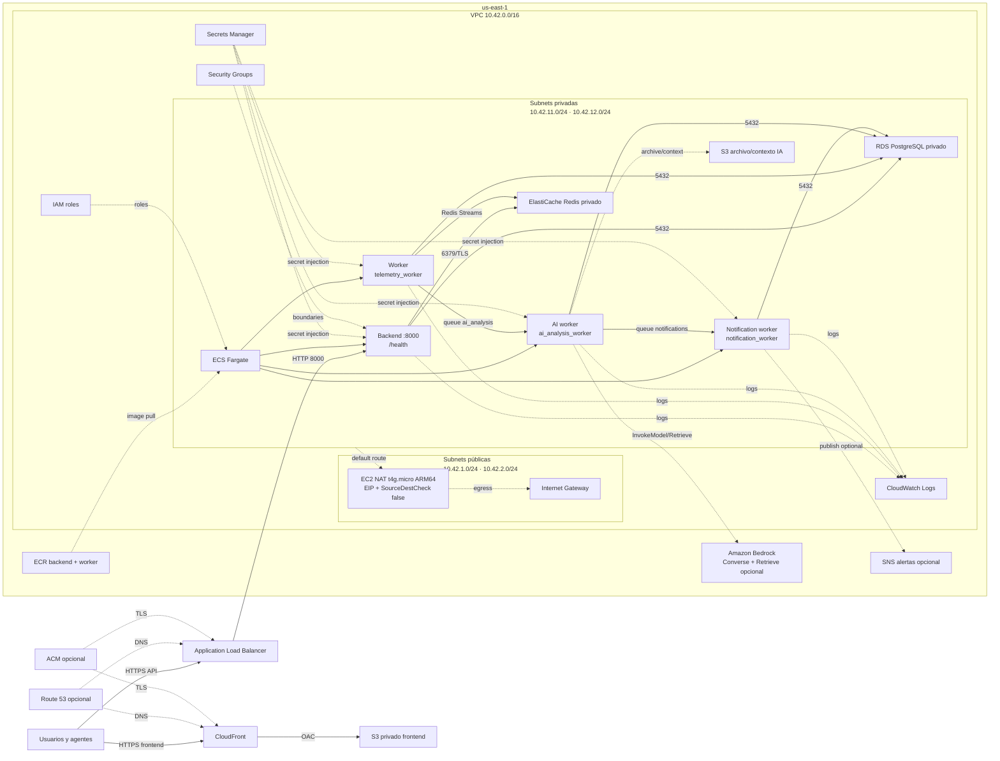

# Arquitectura AWS de SentinelMonitorIA: observabilidad, AIOps y alertas

Diagrama editable:

- [Abrir en diagrams.net](./sentinelmonitoria-aws-architecture.drawio)

El archivo `.drawio` usa `mxgraph.aws4.resourceIcon` y `resIcon=mxgraph.aws4.*`, que corresponden a la biblioteca oficial de iconos AWS integrada en diagrams.net. Si la aplicación no muestra las formas, activar **More Shapes → AWS Architecture** y volver a abrir el archivo.

## Vista de respaldo



## Capas funcionales

| Capa | Implementación local | Implementación AWS |
|---|---|---|
| Ingesta | FastAPI + Redis Streams/PostgreSQL | ALB + ECS backend + ElastiCache/RDS |
| Detección | Reglas Python para CPU, memoria, logs y eventos | Mismo worker ARM64 en ECS; Bedrock no reemplaza las reglas |
| Correlación | Batch actual y eventos persistidos | Worker IA + Redis/PostgreSQL; ventana histórica ampliable |
| Explicación | Ollama opcional | Amazon Bedrock Converse mediante IAM |
| RAG | Contexto acotado del batch; vector store local futuro | S3 + Knowledge Base Bedrock existente/opcional |
| Alertas | `Alert` y `NotificationDelivery` en PostgreSQL | Mismos modelos y workers ECS |
| Notificaciones | log, SMTP, webhooks, Slack, Discord, Teams, WebSocket | SES/SMTP, webhooks, canales chat y WebSocket detrás del ALB |
| Acciones automáticas | Desactivadas | Desactivadas; requieren aprobación, auditoría y rollback |

## Red y fases

| Capa | Detalle |
|---|---|
| Región | `us-east-1`, Norte de Virginia |
| VPC | `10.42.0.0/16` |
| Públicas | `10.42.1.0/24` y `10.42.2.0/24` |
| Privadas | `10.42.11.0/24` y `10.42.12.0/24` |
| Ruta pública | `0.0.0.0/0 → Internet Gateway` |
| Rutas privadas | `0.0.0.0/0 → NAT instance` |
| Backend | ECS/Fargate ARM64, TCP `8000`, health `/health` |
| Worker telemetry | ECS/Fargate ARM64, `python -m src.workers.telemetry_worker` |
| Worker IA | ECS/Fargate ARM64, `python -m src.workers.ai_analysis_worker` |
| Worker notificaciones | ECS/Fargate ARM64, `python -m src.workers.notification_worker` |
| Datos | RDS PostgreSQL privado y Redis privado |
| Archivo IA | S3 privado, fase 19, con cifrado y bloqueo público |
| Frontend | S3 privado + CloudFront/OAC |
| IA gestionada | Bedrock Runtime y Retrieve opcional, fase 19/21 |
| Alertas AWS | SNS opcional y adaptadores de fase 22 |
| TLS/DNS | ACM + Route 53 opcionales, requieren dominio real |

## Relaciones principales

1. El usuario descarga el frontend desde CloudFront; CloudFront lee el bucket S3 mediante Origin Access Control.
2. El cliente consume la API mediante el ALB público, que envía tráfico TCP 8000 al backend en subnets privadas.
3. Backend y worker usan RDS PostgreSQL y Redis mediante sus security groups privados.
4. El worker de telemetry confirma la persistencia del batch y publica una referencia en `ai_analysis`; la ingesta no espera al modelo.
5. El AI worker ejecuta reglas determinísticas, crea `AIAnalysis` y `Alert`, y puede solicitar una explicación a Ollama o Bedrock.
6. El AI worker publica una entrega por canal en `notifications`; el notification worker aplica reintentos, deduplicación y DLQ.
7. `/api/v1/alerts` permite consultar/reconocer alertas y `/api/v1/alerts/ws` transmite novedades mediante polling autenticado.
8. ECS recibe secretos desde Secrets Manager y logs en CloudWatch; los endpoints externos nunca deben escribirse en Git.
9. ECR contiene la imagen ARM64 compartida por telemetry, IA y notificaciones; sólo cambia el comando del contenedor.
10. Las tareas privadas salen a Internet a través de las route tables privadas y la NAT instance.

## Orden CloudFormation

```text
00 VPC
01 NAT
02 Security Groups
03 IAM
04 ECR
05 RDS
06 Redis
07 Application Secrets
08 CloudWatch
09 ALB
10 ECS Cluster
11 ECS Backend
12 ECS Worker telemetry
13 Frontend S3
14 CloudFront
15 Route 53 Hosted Zone
16 ACM Certificates
17 ALB HTTPS
18 Route 53 Records
19 AI platform: S3 archive + IAM Bedrock + logs
20 Notification platform: secret + SNS + logs
21 ECS AI worker
22 ECS notification worker
```

Las fases 15–18 son opcionales hasta controlar un dominio. Las fases 19–22 son la extensión de inteligencia y alertas. La foundation monolítica y los stacks modulares son alternativas; no deben desplegarse juntos en el mismo ambiente.

## Seguridad y operación

- `AI_ENABLE_ACTIONS=false` es el valor esperado y el worker no ejecuta comandos operativos.
- Los logs se tratan como datos no confiables; se redaccionan patrones de tokens antes de enviarlos a un modelo.
- Bedrock usa el task role de la fase 19; en AWS no se deben introducir access keys en las tareas ECS.
- URLs de webhooks, SMTP y tokens de canales deben almacenarse fuera de Git, preferentemente en Secrets Manager.
- Las entregas se registran en `NotificationDelivery`; un error de canal no bloquea la persistencia del batch.
- El Knowledge Base y su vector store no se crean automáticamente; se deben revisar embeddings, índice, retención, permisos y coste antes de activar RAG persistente.

## Límites del diagrama

El diseño representa el camino seleccionado para staging y la extensión implementada. El vector store administrado, SQS/EventBridge, WAF, Multi-AZ completo, réplicas Redis, NAT Gateway y autoscaling avanzado no se crean en las fases actuales. Bedrock, SES y los destinos externos generan costes variables y requieren habilitación/configuración adicional.
