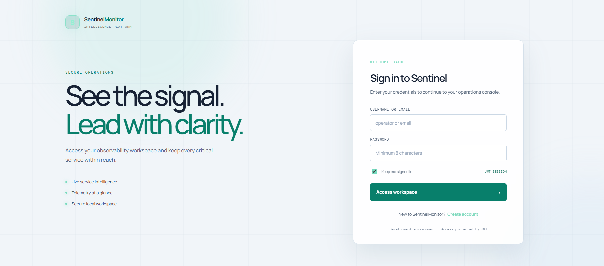
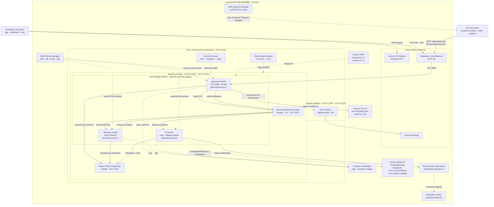
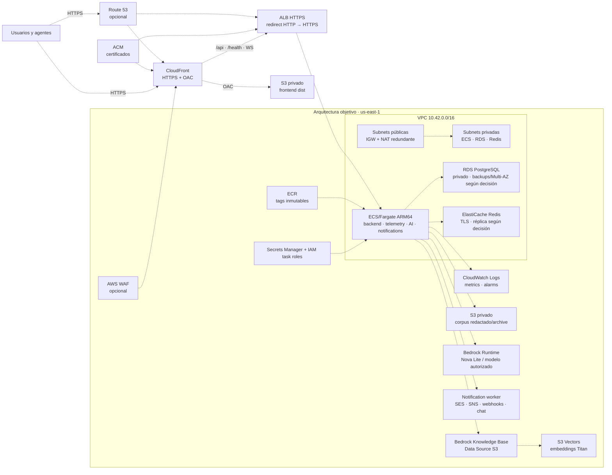
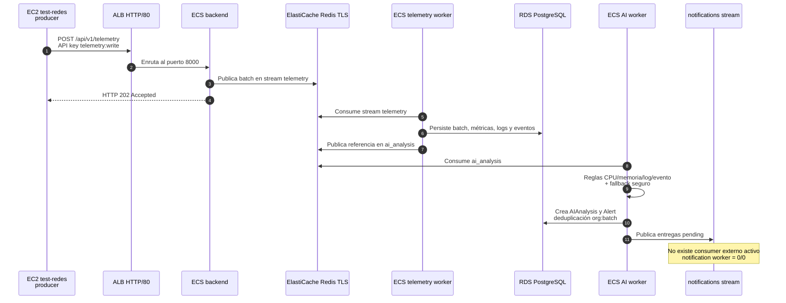
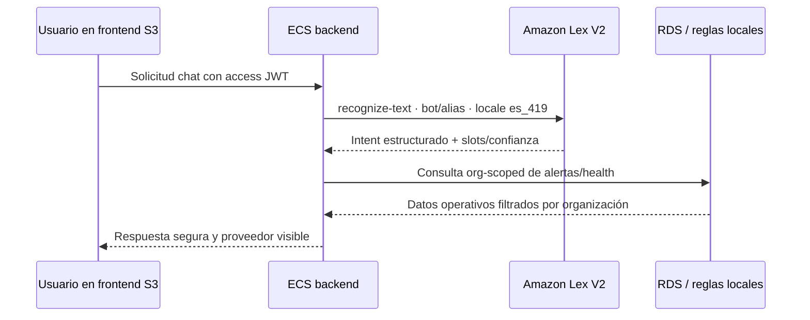

# SentinelMonitorIA · Diagrama completo de infraestructura AWS

<p align="center">
  
  
</p>

<p align="center">
  <strong>Estado operativo del MVP AWS staging + arquitectura objetivo por fases</strong><br>
  Cuenta <code>952763303883</code> · Región <code>us-east-1</code> · Última referencia operativa: 23 de julio de 2026
</p>

> **Alcance.** Este documento separa explícitamente lo que está validado en el staging actual de lo que está preparado como arquitectura objetivo, pero bloqueado, opcional o pendiente de autorización. No contiene contraseñas, API keys, JWT, access keys ni secretos de AWS.

## 1. Lectura rápida

SentinelMonitorIA es una plataforma de observabilidad y AIOps que recibe métricas, logs y eventos, los procesa de forma asíncrona y crea análisis y alertas visibles en el dashboard.

El camino público validado es:

```text
Navegador
  ├── S3 Website HTTP: frontend estático
  └── ALB HTTP/80: API FastAPI
                    │
                    ▼
             ECS/Fargate ARM64
              ├── backend
              ├── telemetry worker
              └── AI worker en fallback determinístico
                    │
          ┌─────────┴─────────┐
          ▼                   ▼
  RDS PostgreSQL       ElastiCache Redis TLS
          │                   │
          └──── Redis Streams ┘
                    │
          AIAnalysis → Alert
                    │
          notificaciones externas apagadas
```

### Objetivo general y resultados esperados

El objetivo de esta infraestructura es desplegar SentinelMonitorIA como una plataforma de observabilidad y AIOps **segura, desacoplada, escalable y gobernable**, capaz de ingerir métricas, logs y eventos, procesarlos en tiempo casi real, detectar incidentes, generar explicaciones operativas y asistir a operadores mediante conversación natural bajo aislamiento por organización.

El diagrama debe leerse en dos niveles:

- **Staging validado:** S3 Website HTTP, ALB HTTP/80, ECS/Fargate ARM64, RDS PostgreSQL privado, Redis TLS, Lex V2, reglas determinísticas y productor sintético EC2.
- **Arquitectura objetivo:** S3 privado + CloudFront/OAC, HTTPS/ACM/Route 53, WAF, alta disponibilidad, autoscaling, Bedrock autorizado, Knowledge Base/RAG y notificaciones aprobadas.

#### A. Ingesta no bloqueante y procesamiento asíncrono

El endpoint `POST /api/v1/telemetry` autentica el agente, publica el batch en Redis Streams y responde `HTTP 202 Accepted` sin esperar a que finalicen la persistencia completa y el análisis. El telemetry worker consume el stream, persiste batch/métricas/logs/eventos en RDS y publica una referencia en `ai_analysis`; el AI worker procesa esa referencia independientemente de la conexión HTTP.

Este desacoplamiento absorbe picos dentro de la capacidad de Redis y de los consumers. No es una garantía ilimitada en el staging: hay un nodo Redis, una tarea por worker y no hay autoscaling avanzado.

#### B. Detección AIOps y reglas determinísticas

El camino operativo actual combina reglas explicables:

- CPU o memoria con unidad `percent` mayor o igual a `90`.
- Logs `error` o `fatal`.
- Eventos `high` o `critical`.
- Deduplicación por organización y `batch_id`.
- Persistencia de `AIAnalysis`, `Alert`, hallazgos, recomendaciones y `analysis_id`.

Bedrock no sustituye estas reglas. Lex V2 interpreta el chat; Bedrock sería el proveedor generativo para explicaciones/RAG, pero no está autorizado en la cuenta actual.

#### C. Aislamiento de red y seguridad

ECS, RDS y Redis se mantienen en subnets privadas; las tareas ECS no reciben IP pública. El ALB es el punto de entrada de la API y sólo el security group del ALB llega al backend en TCP `8000`. RDS acepta tráfico privado en `5432` y Redis usa TLS en `6379`.

Secrets Manager e IAM Task Roles entregan secretos y permisos en runtime. La EC2 del productor se administra con SSM, sin SSH ni puerto `22`. JWT protege la sesión de aplicación, la API key del productor sólo tiene `telemetry:write` y el backend mantiene el aislamiento por organización.

La afirmación “todo tráfico público pasa por el ALB” aplica a la API. En el staging actual los archivos estáticos se entregan directamente desde S3 Website HTTP; CloudFront sería el borde objetivo.

#### D. Coste y ARM64

ECS/Fargate y ECR usan ARM64/Graviton. La NAT instance ARM64 reduce el coste frente a un NAT Gateway y es adecuada para staging temporal. No equivale a alta disponibilidad: es un punto único de fallo. Producción debe evaluar NAT Gateway o redundancia por AZ, RDS Multi-AZ, Redis con failover y autoscaling.

#### E. Asistencia conversacional multi-tenant

Lex V2 está validado con:

- Bot `XFVQNCQTHX`.
- Alias `67MRXD4DQB`.
- Locale `es_419`.
- Intenciones `OpenAlertsIntent`, `CriticalAlertsIntent`, `HealthSummaryIntent`, `AssistanceIntent` y `FallbackIntent`.
- Prueba observada: `OpenAlertsIntent`, confianza `0.9`, diálogo `Close`.

Lex estructura la petición; el backend valida JWT, organización, permisos y datos antes de responder. Lex no implica Bedrock ni embeddings activos.

#### F. Evolución modular y reproducibilidad

Las fases CloudFormation `00`–`22` separan red, NAT, Security Groups, IAM, ECR, persistencia, secretos, observabilidad, ALB, ECS, frontend, CDN, TLS, RAG y notificaciones. La foundation monolítica y los stacks modulares son alternativas excluyentes.

El camino de evolución es:

```text
S3 Website HTTP + ALB HTTP
  → S3 privado + CloudFront/OAC
  → Route 53 + ACM + ALB HTTPS
  → WAF + alta disponibilidad + autoscaling
  → Bedrock autorizado + Knowledge Base + S3 Vectors
  → notificaciones aprobadas, DLQ y auditoría
```

Una plantilla o un ID configurado no demuestra que el recurso esté desplegado, autorizado o validado en la cuenta.

#### Estado confirmado frente a objetivo

| Capacidad | Staging validado | Objetivo de producción |
|---|---|---|
| Ingesta | `202` + Redis Streams | Consumers escalables y capacidad gestionada |
| Detección | Reglas determinísticas + alertas | Correlación histórica y explicación LLM |
| Red | Subnets privadas + ALB HTTP | HTTPS, WAF, Multi-AZ y controles reforzados |
| Cómputo | ECS ARM64, tareas pequeñas | Autoscaling y despliegue multi-AZ |
| Datos | RDS/Redis privados de staging | Backups, failover y retención productiva |
| Chat | Lex V2 `es_419` | Lex + proveedor generativo autorizado |
| RAG | No ingerido | Bedrock Knowledge Base + S3 Vectors |
| Notificaciones | Worker `0/0`, sin destinos externos | Canales aprobados, reintentos, DLQ y auditoría |

#### Bloqueo de Amazon Bedrock: causa y comprobación

La validación de la cuenta devuelve:

```text
amazon.nova-lite-v1:0        → authorizationStatus=NOT_AUTHORIZED
amazon.titan-embed-text-v2:0 → authorizationStatus=NOT_AUTHORIZED
```

La cuenta nueva es una causa probable por verificación/revisión de confianza, pero `NOT_AUTHORIZED` no demuestra por sí solo que la antigüedad sea la única causa. También puede indicar acceso de modelo no habilitado en `us-east-1`, permisos IAM insuficientes, permisos de primera activación/suscripción, facturación pendiente, restricción regional o permisos incompletos para Knowledge Base/S3/Retrieve.

AWS documenta el control de acceso en [Amazon Bedrock Model access](https://docs.aws.amazon.com/bedrock/latest/userguide/model-access.html) y los errores de identidad en [Troubleshooting Amazon Bedrock identity and access](https://docs.aws.amazon.com/bedrock/latest/userguide/security_iam_troubleshoot.html).

Para confirmar el motivo exacto hay que revisar:

1. **Bedrock → Model access** en `us-east-1` para Nova Lite y Titan Embeddings.
2. Estado de verificación de la cuenta, Billing, método de pago y créditos.
3. IAM del perfil CLI y del ECS Task Role, incluyendo `bedrock:InvokeModel` y, para RAG, `bedrock:Retrieve` y acceso a Knowledge Base/S3.
4. CloudTrail para identificar el principal que recibió `AccessDenied`.
5. `get-foundation-model-availability` para cada modelo.

Mientras el resultado no sea `AUTHORIZED`, el AI worker opera correctamente con fallback determinístico, crea `AIAnalysis`/`Alert` y registra la limitación sin reintentos infinitos. Lex V2 continúa funcionando de forma independiente.

### Estado de los componentes principales

| Componente | Estado actual de staging | Tratamiento en el diagrama |
|---|---|---|
| Frontend | S3 Website HTTP público temporal | **Activo y validado** |
| API | ALB público HTTP/80 hacia ECS | **Activo y validado** |
| Backend | ECS/Fargate ARM64, desired/running `1/1`, revisión `5`, `backend:v0.1.2` | **Activo y validado** |
| Telemetry worker | ECS/Fargate ARM64, desired/running `1/1` | **Activo y validado** |
| AI worker | ECS/Fargate ARM64, desired/running `1/1`, revisión `3`, `worker:v0.1.3` | **Activo en modo degradado seguro** |
| Lex V2 | Bot `XFVQNCQTHX`, alias `67MRXD4DQB`, locale `es_419` | **Activo y validado para chat estructurado** |
| RDS PostgreSQL | Privado, consumido por backend y workers | **Activo; infraestructura sin cambios** |
| ElastiCache Redis | Privado, TLS, usado para Streams | **Activo; infraestructura sin cambios** |
| EC2 `test-redes` | Productor sintético controlado por SSM/systemd | **Activo para la demostración** |
| Notification worker | desired/running `0/0` | **Apagado intencionalmente** |
| CloudFront, Route 53, ACM y HTTPS | Bloqueados o no desplegados en este staging | **Objetivo futuro/condicionado** |
| Bedrock y Knowledge Base | `NOT_AUTHORIZED`; no hay RAG validado | **Configurados como extensión, no como evidencia activa** |

## 2. Referencia visual del punto de entrada

La captura adjunta representa la experiencia inicial del frontend: identidad visual de AWS/Código Facilito, marca SentinelMonitor y formulario de acceso protegido por sesión JWT. En el staging funcional, esta interfaz se entrega desde el bucket S3 Website indicado en la sección de acceso.



La imagen es evidencia de la capa de presentación; no sustituye la validación de la API, los servicios ECS, la persistencia ni los workers descritos en este documento.

## 3. Acceso y recursos públicos actuales

| Recurso | Valor | Estado/uso |
|---|---|---|
| Cuenta AWS | `952763303883` | Cuenta del staging documentado |
| Región | `us-east-1` | Norte de Virginia |
| Perfil CLI documentado | `sentinel-monitoria` | Uso administrativo autorizado |
| Cluster ECS | `sentinel-monitoria-staging` | Cluster de aplicación |
| Frontend | [S3 Website](http://sentinelmonitoria-staging-demo-952763303883-20260726060638.s3-website-us-east-1.amazonaws.com) | Acceso recomendado para la demo |
| Bucket frontend | `sentinelmonitoria-staging-demo-952763303883-20260726060638` | Website hosting temporal |
| ALB/API | `http://sm-staging-alb-1278334952.us-east-1.elb.amazonaws.com` | Listener HTTP/80 |
| Swagger | `/api/v1/docs` | Contrato y pruebas de FastAPI |
| Health general | `/health` | PostgreSQL, Redis y telemetry |
| Health API | `/api/v1/health` | Dependencias detalladas |
| Health telemetry | `/api/v1/telemetry/health` | Estado del motor de ingesta |
| Métricas | `/metrics` | Formato Prometheus |

> **Importante:** utilizar el S3 Website HTTP. El hosting HTTPS de Amplify fue eliminado del flujo final y, mientras el ALB sólo tenga HTTP/80, un origen HTTPS puede sufrir mixed content al intentar llamar a la API.

## 4. Diagrama del estado real validado



### Interpretación del diagrama actual

1. El navegador descarga los archivos estáticos directamente desde S3 Website HTTP.
2. El navegador y el productor EC2 consumen la API a través del ALB HTTP/80.
3. El ALB es el único punto público de entrada al backend; las tareas ECS no reciben IP pública.
4. Backend, telemetry worker y AI worker trabajan en la red privada y consumen PostgreSQL y Redis.
5. Redis Streams desacopla la respuesta `202` de la persistencia y del análisis posterior.
6. Lex V2 interpreta la conversación en `es_419`; no implica que Bedrock esté habilitado.
7. El AI worker ejecuta reglas determinísticas, crea `AIAnalysis` y `Alert`, y registra la limitación del proveedor si Bedrock no está autorizado.
8. El stream `notifications` permanece sin un worker externo activo; no se envían correos ni webhooks.

## 5. Arquitectura objetivo por fases

La siguiente vista representa la evolución preparada en CloudFormation. Las líneas discontinuas son componentes todavía no activos, opcionales o condicionados por dominio, certificados, autorización de cuenta o decisión de coste.



### Fases CloudFormation

| Fase | Archivo/alcance | Estado para el staging actual |
|---:|---|---|
| `00` | VPC, IGW, subnets, route tables | Base de red |
| `01` | NAT instance, EIP y rutas privadas | Base de salida; no es HA |
| `02` | Security Groups | Límites ALB/backend/PostgreSQL/Redis |
| `03` | IAM execution/task roles | Obligatorio para ECS |
| `04` | ECR backend/worker | Repositorios de imágenes |
| `05` | RDS PostgreSQL privado | Activo |
| `06` | ElastiCache Redis privado TLS | Activo |
| `07` | Secretos de aplicación | Activo/preparado |
| `08` | CloudWatch Logs | Activo/preparado |
| `09` | ALB HTTP y target group :8000 | Activo |
| `10` | ECS cluster Fargate + Container Insights | Activo |
| `11` | ECS backend | Activo, revisión `5` |
| `12` | ECS telemetry worker | Activo, `1/1` |
| `13` | Frontend S3 | Activo como Website HTTP temporal |
| `14` | CloudFront + OAC | Bloqueado por verificación de cuenta |
| `15` | Route 53 Hosted Zone | Opcional, no activo |
| `16` | Certificados ACM | Opcional, no activo |
| `17` | Listener ALB HTTPS | Opcional, no activo |
| `18` | Registros Route 53 | Opcional, no activo |
| `19` | S3 archive, S3 Vectors, Knowledge Base y roles Bedrock | Preparado; ingesta no validada |
| `20` | Plataforma de notificaciones, secreto/SNS/logs | Preparado; entregas externas apagadas |
| `21` | ECS AI worker | Activo con fallback por `NOT_AUTHORIZED` |
| `22` | ECS notification worker | Deseado `0`, ejecutando `0` |

> La foundation monolítica y las fases modulares `00`–`22` son alternativas de despliegue. No deben aplicarse juntas al mismo entorno porque duplicarían VPC, datos, security groups y repositorios.

## 6. Flujo de datos: telemetry → AIAnalysis → Alert



### Reglas determinísticas que generan hallazgos

- CPU con unidad `percent` mayor o igual a `90`.
- Memoria con unidad `percent` mayor o igual a `90`.
- Log con nivel `error` o `fatal`.
- Evento con severidad `high` o `critical`.
- La clave de deduplicación combina organización y batch.
- La alerta conserva `analysis_id`, `rule_id`, batch, agente, hallazgos y recomendaciones.
- `AI_ENABLE_ACTIONS=false`: detectar y explicar no significa ejecutar remediación.

### Productor sintético EC2

| Propiedad | Valor |
|---|---|
| Instancia | `test-redes` |
| Instance ID | `i-0c56b84145cd08d22` |
| Tipo/OS | `t3.micro` · Amazon Linux 2023 · `x86_64` |
| Administración | Systems Manager, sin SSH ni puertos nuevos |
| Usuario | `sentinel-demo` |
| Script | `/opt/sentinel-mvp/mvp-demo-producer.py` |
| Servicio | `sentinel-mvp-demo-producer.service` |
| Entorno | `/etc/sentinel-mvp/producer.env`, modo `0600` |
| Agent ID | `ec2-test-redes-synthetic` |

El productor no genera carga real: los valores altos son valores del payload. Envía heartbeats normales cada `30–60` segundos e incidentes cada `300–600` segundos, con UUID por batch, reintentos limitados y tags `environment=mvp-demo`, `synthetic=true`, `source=continuous-demo`.

## 7. Flujo del chat Lex V2



Valores validados:

| Propiedad | Valor |
|---|---|
| Bot | `XFVQNCQTHX` |
| Alias | `67MRXD4DQB` (`staging`) |
| Locale | `es_419` |
| Intenciones | `OpenAlertsIntent`, `CriticalAlertsIntent`, `HealthSummaryIntent`, `AssistanceIntent`, `FallbackIntent` |
| Prueba observada | `OpenAlertsIntent`, confianza `0.9`, diálogo `Close` |
| Bedrock en el chat | No se invoca |
| Embeddings en el chat | No se usan |

Lex interpreta la conversación; el backend mantiene la autenticación JWT, el aislamiento por organización, las reglas de respuesta y la auditoría. El identificador interno heredado `lex_bedrock` no debe interpretarse como evidencia de Bedrock autorizado.

## 8. Inventario de servicios y responsabilidades

| Capa | Servicio/recurso | Responsabilidad | Exposición |
|---|---|---|---|
| Presentación | S3 Website | Entregar React/Vite estático para la demo | Público HTTP temporal |
| Entrada API | ALB | Distribuir HTTP/80 al backend y ejecutar health checks | Público HTTP |
| Aplicación | ECS/Fargate backend | Auth, organizaciones, telemetry, chat, alertas y API | Sólo desde ALB |
| Ingesta | ECS telemetry worker | Consumir Redis, persistir datos y publicar `ai_analysis` | Sin listener público |
| Análisis | ECS AI worker | Reglas, análisis, `AIAnalysis`, `Alert` y stream de notificaciones | Sin listener público |
| Notificación | ECS notification worker | Entregas externas idempotentes | Apagado `0/0` en staging |
| Conversación | Amazon Lex V2 | Intenciones y slots en español latinoamericano | Invocado por backend |
| Persistencia | RDS PostgreSQL | Usuarios, organizaciones, batches, análisis, alertas y entregas | Privado TCP/5432 |
| Colas | ElastiCache Redis Streams | `telemetry`, `ai_analysis`, `notifications`, ACK/retry/DLQ | Privado TLS TCP/6379 |
| Imágenes | ECR | Imágenes ARM64 backend/worker con tags inmutables | IAM/ECS |
| Secretos | Secrets Manager | DB, Redis, JWT, app y canales | IAM task roles |
| Observabilidad | CloudWatch Logs/Container Insights | Logs de tareas, ALB y métricas de plataforma | IAM |
| Operación EC2 | Systems Manager | SSM Run Command/Session Manager sin SSH | Plano de control AWS |
| Salida de red | NAT instance + EIP | Egreso de subnets privadas en staging | Público sólo para salida |
| Red | VPC, IGW, route tables, SG | Segmentación y control de tráfico | No aplicable |

## 9. Red y seguridad

### Topología de red

| Elemento | Contrato documentado |
|---|---|
| Región | `us-east-1` |
| VPC | `10.42.0.0/16` |
| Subnets públicas | `10.42.1.0/24`, `10.42.2.0/24` |
| Subnets privadas | `10.42.11.0/24`, `10.42.12.0/24` |
| Ruta pública | `0.0.0.0/0 → Internet Gateway` |
| Ruta privada | `0.0.0.0/0 → NAT instance` |
| Target backend | TCP `8000`, health `/health`, target type `ip` |
| Base de datos | RDS privado, no URL de administración pública |
| Redis | ElastiCache privado con `TransitEncryptionEnabled`/`REDIS_TLS=true` |
| ECS | `AssignPublicIp=DISABLED` para tareas privadas |

### Reglas de acceso

```text
Internet / jurado
  ├── HTTP/80 → S3 Website
  └── HTTP/80 → ALB SG → backend SG :8000
                                      ├── RDS SG :5432
                                      └── Redis SG :6379/TLS

EC2 test-redes
  ├── SSM control plane → AWS Systems Manager
  └── HTTP → ALB → /api/v1/telemetry con API key scope telemetry:write
```

Controles importantes:

- RDS, Redis, ECS tasks y secretos permanecen en redes privadas.
- Sólo el security group del ALB puede llegar al backend en TCP/8000.
- RDS y Redis aceptan tráfico del security group del backend, no del navegador.
- Redis usa TLS; los workers deben usar `rediss://` y `REDIS_TLS=true`.
- ECS usa execution/task roles IAM; no se deben introducir access keys en contenedores.
- Secrets Manager inyecta credenciales; no se guardan secretos en templates, Git ni diagramas.
- JWT protege la sesión de la aplicación; las API keys tienen scopes y el productor sólo tiene `telemetry:write`.
- El backend aplica aislamiento por organización para chat, alertas y telemetry.
- Los logs son datos no confiables; se deben redactar tokens antes de enviarlos a un modelo.
- `AI_ENABLE_ACTIONS=false` permanece forzado; el sistema no ejecuta comandos de remediación.
- SSM reemplaza SSH para administrar la EC2; no se abrieron puertos nuevos.
- El S3 Website HTTP es una concesión temporal de staging y no debe presentarse como diseño de producción.

## 10. Estado ECS y configuración efectiva

| Servicio | Desired | Running | Revisión/imagen | Comportamiento efectivo |
|---|---:|---:|---|---|
| `sentinel-monitoria-staging-backend` | 1 | 1 | Rev. `5` · `backend:v0.1.2` | API, auth, telemetry, chat y alertas |
| `sentinel-monitoria-staging-worker` | 1 | 1 | ARM64 | Persistencia de telemetry y `ai_analysis` |
| `sentinel-monitoria-staging-ai-worker` | 1 | 1 | Rev. `3` · `worker:v0.1.3` | Reglas + fallback determinístico; Bedrock no autorizado |
| `sentinel-monitoria-staging-notification-worker` | 0 | 0 | No activo | Sin entregas externas |

Variables y límites relevantes:

- `CHAT_PROVIDER`/Lex: Lex V2 en `es_419` para el chat estructurado.
- `AI_PROVIDER=bedrock` y `AI_MODEL_ID=amazon.nova-lite-v1:0`: configuración preparada, pero el proveedor devuelve `NOT_AUTHORIZED`.
- `AI_ENABLE_ACTIONS=false`: no se ejecutan acciones.
- `NOTIFICATION_CHANNELS=log`: canal seguro de configuración; no equivale a emails, webhooks o mensajería externa.
- Knowledge Base `0MZLR4E2G7`: referencia configurada, sin ingesta/RAG validado en la cuenta actual.

### Diferencia entre configuración y evidencia

No se debe presentar la presencia de una variable `AI_PROVIDER=bedrock`, un ID de Knowledge Base o una plantilla CloudFormation como prueba de que Bedrock o RAG están funcionando. La evidencia actual es:

1. El AI worker recibe el mensaje.
2. Ejecuta reglas determinísticas.
3. Persiste `AIAnalysis` y `Alert`.
4. Registra el error de autorización del proveedor cuando corresponde.
5. Mantiene el flujo funcional sin reintentos infinitos ni acciones externas.

## 11. Observabilidad y operación

### Puntos de comprobación

| Punto | Resultado esperado |
|---|---|
| S3 Website raíz | HTTP `200` |
| ALB `/health` | HTTP `200` |
| `/api/v1/health` | Dependencias saludables |
| `/api/v1/telemetry/health` | HTTP `200`, `healthy` |
| `/metrics` | HTTP `200`, Prometheus |
| Swagger `/api/v1/docs` | HTTP `200` |
| ECS backend | desired/running `1/1` |
| ECS telemetry worker | desired/running `1/1` |
| ECS AI worker | desired/running `1/1` |
| Notification worker | desired/running `0/0` |
| `notifications` | Profundidad `0` |
| EC2 producer | systemd `enabled/active`, usuario no root |
| Productor env | `root:root`, modo `0600` |

### Señales y evidencia

- Telemetry one-shot: HTTP `202`.
- Health general y telemetry: HTTP `200`.
- Chat autenticado: HTTP `200`, conversación creada.
- Lex: `OpenAlertsIntent`, confianza observada `0.9`, diálogo cerrado.
- Alertas: severidad `high`, `rule_id=metric.cpu.high`, `analysis_id` presente.
- Logs: CloudWatch para ECS; journald para el productor EC2.
- Métricas: endpoint Prometheus `/metrics`, health checks de ALB y Container Insights.
- `XLEN` de un stream histórico no debe confundirse automáticamente con backlog pendiente; la profundidad operativa relevante para la demo es `notifications=0`.

### Operación segura de la demostración

1. Usar el S3 Website HTTP y realizar `Ctrl+F5`.
2. Verificar `/health` y `/api/v1/telemetry/health`.
3. Confirmar el servicio `sentinel-mvp-demo-producer.service` mediante SSM.
4. Mostrar el dashboard, Lex V2, una alerta `high` y su `analysis_id`.
5. No mostrar secretos en consola o capturas.
6. Mantener el notification worker en `0/0`.
7. Después de la evaluación, detener el productor, revocar la API key demo y revisar recursos facturables.

## 12. Coste, disponibilidad y límites

Las cifras siguientes son planificación, no una factura:

| Escenario | Estimación |
|---|---:|
| Foundation NAT/RDS/Redis/ECR | USD `35–55/mes` |
| Staging ARM64 completo sin Bedrock/S3 Vectors | USD `95–120/mes` |
| Prueba aproximada de 72 horas para la base | USD `9.37–11.84` |
| Bedrock, Knowledge Base y S3 Vectors | Variable; no incluido en los rangos base |

Riesgos y decisiones:

- Una NAT instance reduce coste frente a NAT Gateway, pero es un punto único de fallo y no ofrece HA por AZ.
- RDS y Redis de staging son pequeños y no representan un diseño Multi-AZ de producción.
- S3 Website HTTP no proporciona el borde HTTPS de producción.
- ALB, CloudFront, IPv4, logs, backups, transferencia y Bedrock pueden cambiar el coste real.
- CloudFront/ACM/Route 53/WAF, SQS/EventBridge, NAT Gateway, réplicas Redis, Multi-AZ y autoscaling avanzado quedan fuera del staging actual.
- Antes de activar RAG se deben revisar autorización Bedrock, embeddings, ingesta, retención, permisos y presupuestos.

## 13. Bloqueos y componentes futuros

| Componente | Motivo por el que no se presenta como activo |
|---|---|
| CloudFront | La cuenta requiere verificación antes de crear nuevos recursos CloudFront |
| Route 53/ACM/HTTPS | No hay dominio/certificado/listener HTTPS operativo en este staging |
| Bedrock Nova Lite | `authorizationStatus=NOT_AUTHORIZED` |
| Titan Embeddings V2 | `authorizationStatus=NOT_AUTHORIZED` |
| Knowledge Base/RAG | No se inició una ingesta efectiva validada |
| Notification worker | Se mantiene `0/0` para impedir efectos externos |
| Email/Slack/Discord/Teams/webhooks | No se activaron destinos externos |
| Acciones automáticas | Deshabilitadas por `AI_ENABLE_ACTIONS=false` |
| WAF/SQS/EventBridge/Multi-AZ/autoscaling | Fuera del alcance inicial |

## 14. Referencia de código y despliegue

| Área | Archivo |
|---|---|
| Arquitectura previa y Draw.io | `docs/architecture/sentinelmonitoria-aws-architecture.md` · `.drawio` |
| Estado operativo staging | `docs/deployment/mvp-staging.md` |
| Fases CloudFormation | `docs/deployment/cloudformation-phased-plan.md` |
| Estimación de costes | `docs/deployment/aws-monthly-estimate.md` |
| Publicación frontend | `scripts/publish-frontend.ps1` |
| Productor sintético | `scripts/mvp-demo-producer.py` |
| Instalación EC2 por SSM | `scripts/install-mvp-demo-producer.ps1` |
| Worker de telemetry | `backend/src/workers/telemetry_worker.py` |
| Worker de análisis | `backend/src/workers/ai_analysis_worker.py` |
| Reglas de inteligencia | `backend/src/services/ai/analyzer.py` |
| Proveedores de chat | `backend/src/services/chat/providers.py` |
| Templates modulares | `infra/cloudformation/phases/00-*.yaml` a `22-*.yaml` |

## 15. Checklist antes de promover a producción

- [ ] Reemplazar S3 Website HTTP por S3 privado + CloudFront/OAC.
- [ ] Configurar dominio, Route 53, ACM y ALB HTTPS.
- [ ] Validar CORS sólo para orígenes HTTPS aprobados.
- [ ] Sustituir NAT instance por una arquitectura redundante si el SLA lo exige.
- [ ] Revisar RDS Multi-AZ, backups, retención y restauración.
- [ ] Revisar Redis TLS, failover, backups y capacidad.
- [ ] Habilitar WAF, rate limits y alarmas de CloudWatch según el riesgo.
- [ ] Obtener autorización de Bedrock y validar límites de tokens/coste.
- [ ] Validar Titan Embeddings, Knowledge Base, S3 Vectors e ingesta con documentos redactados.
- [ ] Activar notificaciones sólo con aprobación, secretos en Secrets Manager, reintentos y DLQ.
- [ ] Mantener `AI_ENABLE_ACTIONS=false` hasta tener aprobación, auditoría y rollback.
- [ ] Definir autoscaling, Multi-AZ y pruebas de carga.
- [ ] Revisar presupuesto, coste real y limpieza de recursos temporales.
- [ ] Revocar las credenciales de demo y retirar datos sintéticos de evaluación.

## Fuentes de verdad relacionadas

- [README principal](../../README.md)
- [Índice de documentación](../README.md)
- [Índice de arquitectura](README.md)
- [MVP AWS staging](../deployment/mvp-staging.md)
- [Plan CloudFormation por fases](../deployment/cloudformation-phased-plan.md)
- [Estimación mensual AWS](../deployment/aws-monthly-estimate.md)
- [Dossier técnico del jurado](../jury/SentinelMonitorIA-Dossier-Jurado-AWS-Codigo-Facilito.md)
